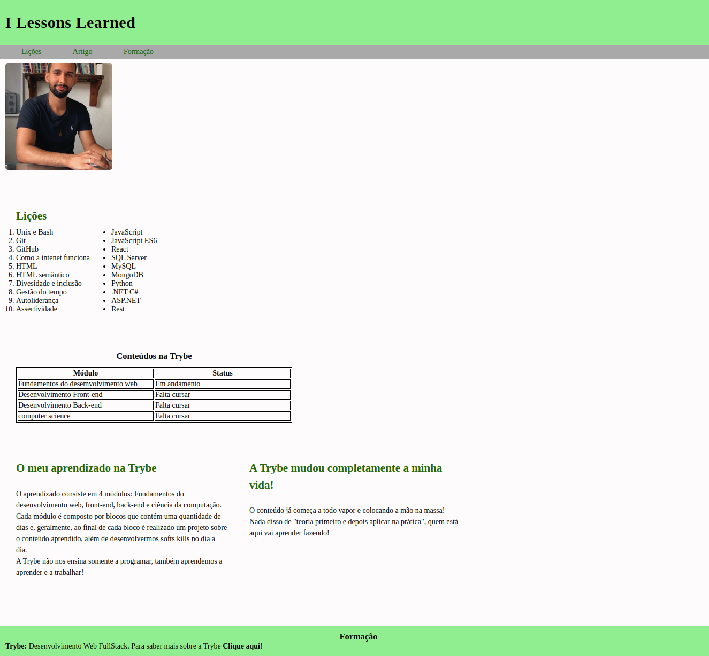
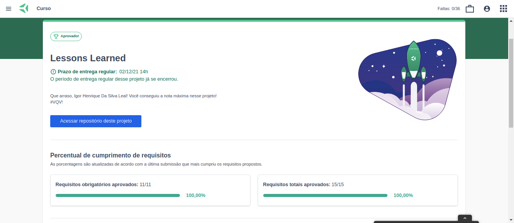

Esse é um projeto desenvolvido em HTML e CSS ao final do Bloco 3 do Módulo 1 do curso de Desenvolvimento Web da [Trybe](https://www.betrybe.com/).
Concluí 100% dos requisitos obrigatórios e opcionais.

O projeto consiste no desenvolvimento de uma página web contendo uma lista de lições aprendidas até o bloco mencionado acima e outra lista contendo habilidades que desejo aprender futuramente. Contém também um pequeno artigo sobre mim. 

